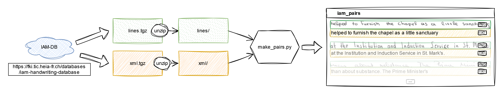
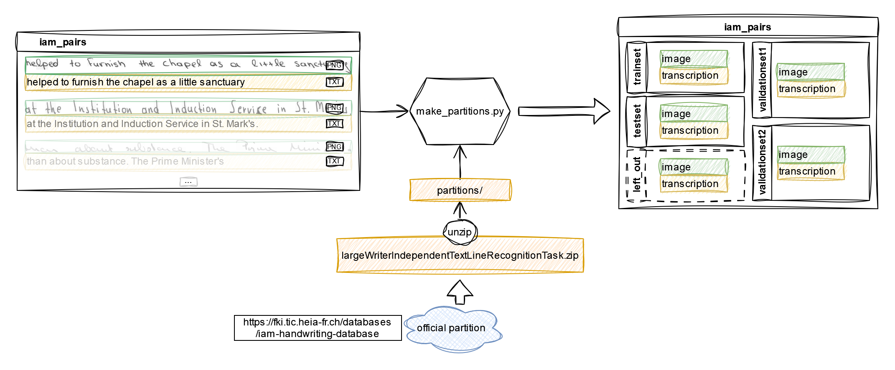

# What are these scripts?

`make_pairs.py` helps creating a folder containing the IAM-DB lines in the form of pairs of PNG + TXT. Which is more suitable for training transcription models with HTR engines line Kraken or PyLaia. 

> Note: you still need to be granted access to the IAM-DB and to download and unzip the corresponding archives (xml.tgz and lines.tgz) before using the script.

`make_partitions.py` uses the output of the previous script and the official partition defined for the "Large Writer Independent Text Line Recognition Task" (see [here](https://fki.tic.heia-fr.ch/databases/iam-handwriting-database)) to organize the resulting folder into subsets correspondng to the official sets.

> Note: you still need to download and unzip the archive containing the listing of line ids for each partition before using this script, and you need to run `make_pairs.py` first. 

